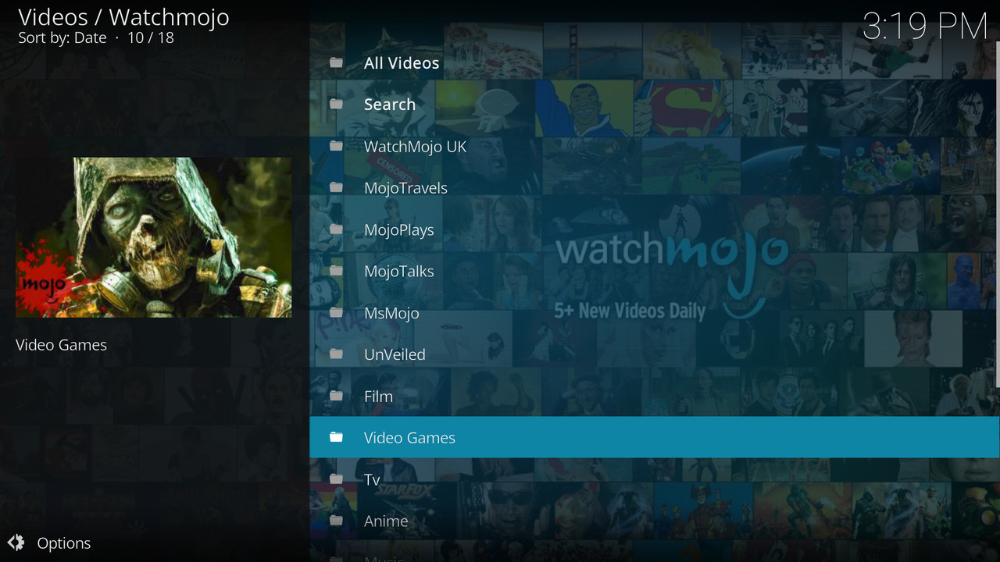
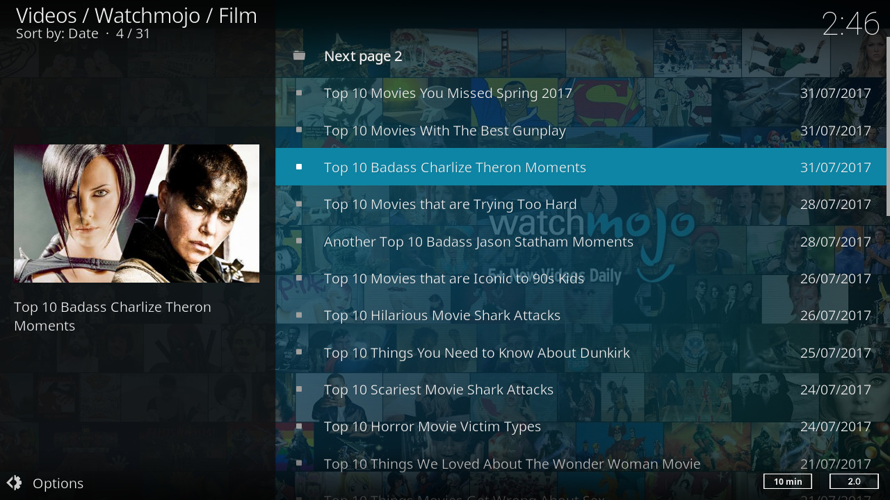
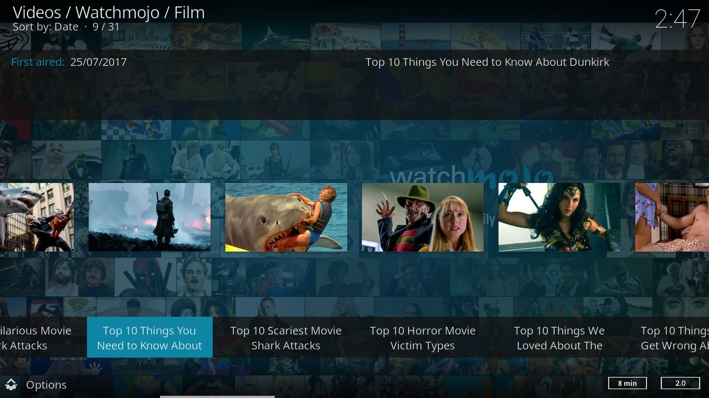

.. image:: https://travis-ci.org/willforde/plugin.video.watchmojo.svg?branch=master
    :target: https://travis-ci.org/willforde/plugin.video.watchmojo

.. image:: https://coveralls.io/repos/github/willforde/plugin.video.watchmojo/badge.svg?branch=master
    :target: https://coveralls.io/github/willforde/plugin.video.watchmojo?branch=master

.. image:: https://api.codacy.com/project/badge/Grade/31a9578f9a004453b4bb590c50d12579
    :target: https://www.codacy.com/app/willforde/plugin.video.watchmojo?utm_source=github.com&amp;utm_medium=referral&amp;utm_content=willforde/plugin.video.watchmojo&amp;utm_campaign=Badge_Grade

Watchmojo -> https://www.watchmojo.com
======================================

This is a kodi video add-on for Watchmojo Top 10 lists on Music, TV, Film and Video Games.

Top 10 lists on Music, TV, Film and Video Games. We publish 4 or more Top 10s daily.
Subscribe for new top 10 lists every day, and binge watch on Top 10s covering Pop Culture, Celebrity,
Movies, Music, TV, Film, Video Games, Politics, News, Comics and Superheroes. WatchMojo’s back catalogue
has ten thousand videos on Top 10 lists, Origins, Biographies, Tips, How To’s, Reviews,
Commentary and moreYour trusted authority on ranking Pop Culture.

Download
--------
The add-on is available in the official kodi repository for kodi v17 "Krypton" and later.

**Automated Tests:** https://travis-ci.org/willforde/plugin.video.watchmojo

**Kodi Forum:** https://forum.kodi.tv/showthread.php?tid=178802
